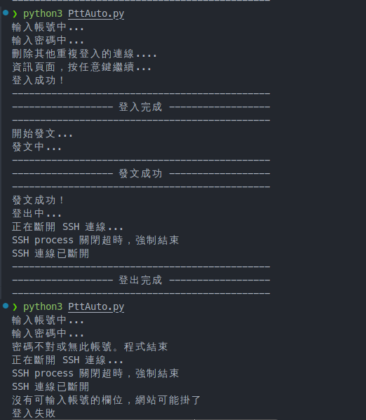

# PttAutoLoginPost

PTT自動登入發文(Python) for Windows and Linux

* [Demo Video](https://youtu.be/FkdR6C-a9Nw) - Linux

## 版本歷史

* **Python 3.13**: 當前版本，包含類型提示、改進的錯誤處理、現代 Python 語法和穩定性改進
* Python 3.4.3: 原始版本
* Python 2.7.3: 舊版本，可參考 [20a029ab14f55e81b](https://github.com/twtrubiks/PttAutoLoginPost/tree/20a029ab14f55e81b790c90698c8cd0d0b03ad3d)

## 特色

* 自動登入PTT發文，再登出PTT
* **Python 3.13** 現代語法支援
* **SSH 連線** 替代已關閉的 telnet 連線
* **async/await** 異步程式設計模式
* **asyncssh** 現代 SSH 客戶端庫
* **類型提示** 提升程式碼可讀性
* **改進的錯誤處理** 更穩定的執行
* **完整的文檔字符串** 便於理解和維護
* **超時保護機制** 防止程式卡住或無限等待
* **智能連線管理** 自動偵測並處理連線異常
* **強化穩定性** 各種異常情況下都能正常退出

## 執行過程



## 執行環境

### 系統需求

* **Python 3.13.0 或更高版本**
* **luit** 工具（用於處理 Big5 編碼）
* **asyncssh** 套件（SSH 連線庫）
* 穩定的網路連線

### 安裝

#### 1. 安裝 luit 工具

```bash
# Ubuntu/Debian
sudo apt-get install luit
```

#### 2. 安裝 Python 依賴

```bash
pip install -r requirements.txt
```

### 重要變更說明

🚨 **PTT 已關閉 Telnet 連線服務**

由於 PTT 已經關閉了 telnet 連線服務，本專案已更新為使用 **SSH 連線 + luit 編碼處理**。

#### 主要改進

* **SSH 連線**：使用 asyncssh 庫進行 SSH 連線
* **Big5 編碼支援**：模擬 luit 工具的編碼處理
* **更安全**：SSH 連線提供加密傳輸
* **async/await 支援**：採用現代異步程式設計
* **ANSI 處理**：自動移除終端控制字符
* **更好的類型檢查**：完整的類型提示支援
* **改進的錯誤訊息**：更清楚的除錯資訊
* **超時控制**：所有 I/O 操作都有超時限制，避免程式卡住
* **資源管理**：確保 SSH 連線在任何情況下都能正確關閉
* **異常恢復**：密碼錯誤、連線中斷等情況下能自動處理並退出

### SSH 連線需求

* **Python 3.13.0+**
* **SSH 連線支援**：PTT 伺服器必須支援 SSH
* **asyncssh 庫**：用於 SSH 連線

### 連線方式比較

| 連線方式 | 狀態 | 安全性 | 支援度 |
|---------|------|--------|--------|
| Telnet  | ✗ 已關閉 | 低 | 原本支援 |
| SSH     | ✓ 支援 | 高 | 現在使用 |
| WebSocket | ❓ 未知 | 中 | 未來選項 |

## 使用方法

### 1. 設定帳號密碼

編輯 `PttAuto.py` 檔案，修改以下行數：

```python
# 設定連線參數
host: str = 'ptt.cc'
user: str = 'Your PTT ID'          # 請修改為您的 PTT 帳號
password: str = 'Your PTT Password'  # 請修改為您的 PTT 密碼
```

### 2. 執行程式

```bash
python3 PttAuto.py
```

如果要調整發文看板以及訊息可修改以下程式碼

```python

...

post_success = await ptt.post('test', '發文文字測試', '這是一篇測試,哇哈哈')

...
```

### 3. 手動 SSH 連線測試

如果您想手動測試 PTT SSH 連線，可以使用：

```bash
# 使用 luit 處理 Big5 編碼
luit -encoding big5 ssh bbs@ptt.cc

# 或直接 SSH 連線(通常中文會有亂碼, 才使用 luit 協助)
ssh bbs@ptt.cc
```

### 程式穩定性

本程式已針對各種異常情況進行優化：
- **連線超時**：3 秒超時限制，避免無限等待
- **寫入超時**：2 秒超時限制，防止資料傳輸卡住
- **資源清理**：確保 SSH 連線在任何情況下都能正確關閉
- **錯誤恢復**：所有已知錯誤情況都有對應的處理機制

## Donation

文章都是我自己研究內化後原創，如果有幫助到您，也想鼓勵我的話，歡迎請我喝一杯咖啡 :laughing:


[贊助者付款](https://payment.opay.tw/Broadcaster/Donate/9E47FDEF85ABE383A0F5FC6A218606F8)

## License

MIT license
